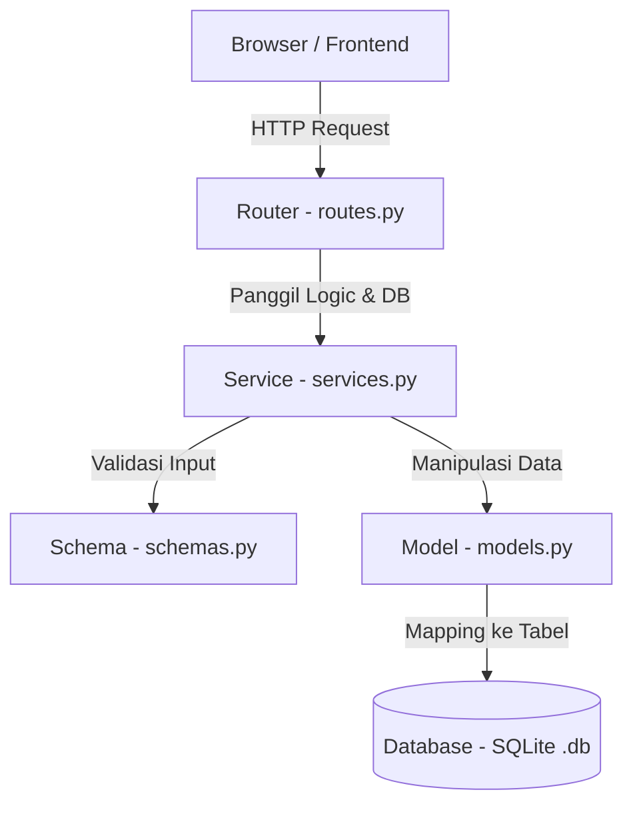

# Panduan Developer: Dokumentasi Tech Stack SmartStudy

Dokumen ini dirancang khusus untuk membantu developer baru yang pertama kali menggunakan **React.js** (Frontend) dan **FastAPI** (Backend) agar dapat memahami arsitektur, alur kerja, dan cara kerja teknologi yang digunakan dalam proyek **SmartStudy**.

---

## 🎨 FRONTEND TECH STACK

### 1. React.js
#### A. Apa itu?
React adalah library JavaScript buatan Meta (Facebook) yang digunakan untuk membangun User Interface (UI) yang interaktif berbasis komponen (*component-based*).

#### B. Mengapa Proyek Ini Menggunakan React?
*   **Reusabilitas Komponen:** Developer bisa memecah UI menjadi bagian-bagian kecil (seperti `Button`, `Navbar`, `TaskCard`) yang dapat digunakan kembali di berbagai halaman.
*   **Virtual DOM:** React hanya meng-update bagian halaman web yang berubah saja tanpa memuat ulang seluruh halaman, membuat aplikasi terasa sangat cepat dan responsif.
*   **State Management:** Memudahkan pengelolaan data dinamis (misalnya, daftar tugas yang diambil dari backend).

#### C. Di mana letaknya pada proyek?
*   Konfigurasi proyek: [frontend/package.json](file:///home/naufal/Documents/my-projects/inkubasi-sija/frontend/package.json)
*   Entry point aplikasi: [frontend/src/main.jsx](file:///home/naufal/Documents/my-projects/inkubasi-sija/frontend/src/main.jsx)
*   Komponen utama: [frontend/src/App.jsx](file:///home/naufal/Documents/my-projects/inkubasi-sija/frontend/src/App.jsx)

#### D. Bagaimana cara kerjanya?
React menggunakan konsep **Component** dan **State**. Komponen adalah fungsi JavaScript yang mengembalikan kode JSX (mirip HTML). **State** adalah memori internal komponen untuk menyimpan data. Ketika state berubah, React secara otomatis menggambar ulang (*render*) komponen tersebut untuk memperbarui tampilan UI secara langsung.

#### E. Kapan developer akan menggunakannya?
*   Saat ingin membuat elemen UI baru (tombol, input, form).
*   Saat perlu menangani interaksi pengguna (klik tombol, input teks).
*   Saat menampilkan data dinamis dari API FastAPI.

#### F. Contoh Sederhana pada Proyek
Pada [frontend/src/App.jsx](file:///home/naufal/Documents/my-projects/inkubasi-sija/frontend/src/App.jsx#L7-L31):
```jsx
import { useState } from 'react'

function App() {
  // State untuk menyimpan hitungan klik
  const [count, setCount] = useState(0)

  return (
    <>
      <section id="center">
        {/* Tombol yang ketika diklik akan menambah state count */}
        <button
          type="button"
          className="counter"
          onClick={() => setCount((count) => count + 1)}
        >
          Count is {count}
        </button>
      </section>
    </>
  )
}
```

---

### 2. react-router
#### A. Apa itu?
`react-router` (atau secara spesifik `react-router-dom` untuk web) adalah library standar untuk mengelola navigasi halaman (routing) di dalam aplikasi React tanpa memicu reload halaman penuh (Single Page Application).

#### B. Mengapa Proyek Ini Menggunakan react-router?
*   Membuat transisi halaman instan dan mulus.
*   Memungkinkan URL web sinkron dengan tampilan UI (contoh: `/dashboard` untuk dashboard, `/tasks` untuk daftar tugas).
*   Mempermudah pembagian hak akses halaman (misal: proteksi halaman agar hanya bisa diakses setelah login).

#### C. Di mana letaknya pada proyek?
*(Direkomendasikan untuk diimplementasikan)*
*   Pendaftaran rute: [frontend/src/main.jsx](file:///home/naufal/Documents/my-projects/inkubasi-sija/frontend/src/main.jsx) atau file routing khusus seperti `frontend/src/routes.jsx`.
*   Navigasi antar halaman: Digunakan pada komponen Navigasi (Header/Sidebar).

#### D. Bagaimana cara kerjanya?
Developer mendefinisikan rute (*routes*) berupa pasangan antara **path URL** (misal: `/tasks`) dan **komponen React** yang ingin ditampilkan (misal: `<TasksPage />`). `react-router` menangkap perubahan URL di browser, mencegah reload bawaan browser, dan langsung menukar komponen yang aktif di layar.

#### E. Kapan developer akan menggunakannya?
*   Saat membuat halaman baru (misal: Halaman Login, Profil, Rekomendasi Tugas AI).
*   Saat ingin membuat link/navigasi yang berpindah halaman menggunakan komponen `<Link>` dari `react-router-dom`.

#### F. Contoh Struktur Implementasi
Developer dapat mengonfigurasi router di `frontend/src/main.jsx` seperti berikut:
```jsx
import { createBrowserRouter, RouterProvider } from 'react-router-dom'
import Dashboard from './pages/Dashboard'
import Tasks from './pages/Tasks'

const router = createBrowserRouter([
  {
    path: "/",
    element: <Dashboard />,
  },
  {
    path: "/tasks",
    element: <Tasks />,
  }
])

createRoot(document.getElementById('root')).render(
  <StrictMode>
    <RouterProvider router={router} />
  </StrictMode>
)
```
Untuk berpindah halaman tanpa reload, gunakan komponen `<Link>` di navigasi:
```jsx
import { Link } from 'react-router-dom';

function Navigation() {
  return (
    <nav>
      <Link to="/">Dashboard</Link>
      <Link to="/tasks">Daftar Tugas</Link>
    </nav>
  );
}
```

---

### 3. TailwindCSS
#### A. Apa itu?
TailwindCSS adalah framework CSS berbasis *utility-first* yang menyediakan class-class siap pakai langsung di dalam tag HTML/JSX (seperti `flex`, `pt-4`, `text-center`, `bg-blue-500`).

#### B. Mengapa Proyek Ini Menggunakan TailwindCSS?
*   **Proses Desain Cepat:** Developer tidak perlu menulis file CSS terpisah dan memikirkan nama class CSS secara manual.
*   **Konsistensi Desain:** Memastikan ukuran font, warna, dan spacing seragam mengikuti konfigurasi [docs/DESIGN.md](file:///home/naufal/Documents/my-projects/inkubasi-sija/docs/DESIGN.md).
*   **Responsif Bawaan:** Sangat mudah membuat layout responsif (untuk HP/Tablet/Laptop) hanya dengan menambahkan prefix seperti `md:` atau `lg:`.

#### C. Di mana letaknya pada proyek?
*   File CSS utama proyek: [frontend/src/index.css](file:///home/naufal/Documents/my-projects/inkubasi-sija/frontend/src/index.css)
*   Konfigurasi tema (warna, font, spacing): `frontend/tailwind.config.js`

#### D. Bagaimana cara kerjanya?
Tailwind menscan semua file React (`.jsx` atau `.tsx`), mencari nama-nama class utility yang digunakan, lalu men-generate file CSS akhir yang berisi hanya CSS yang benar-benar dipakai di proyek tersebut.

#### E. Kapan developer akan menggunakannya?
*   Setiap kali mendesain tampilan komponen (mengatur warna latar belakang, margin, padding, border, tata letak flex/grid).
*   Saat ingin menerapkan gaya interaktif (seperti hover: `hover:bg-blue-600`) atau responsif (`md:flex-row`).

#### F. Contoh Struktur Implementasi
Sesuai panduan di [docs/DESIGN.md](file:///home/naufal/Documents/my-projects/inkubasi-sija/docs/DESIGN.md), untuk membuat kartu tugas dengan warna primary (`#111827`), latar neutral (`#F9FAFB`), dan tombol kobalt (`#2563EB`):
```jsx
export default function TaskCard({ title, description }) {
  return (
    <div className="bg-white border border-gray-200 rounded-lg p-6 shadow-sm max-w-sm">
      <h2 className="text-gray-900 font-bold text-xl mb-2">{title}</h2>
      <p className="text-gray-500 text-sm mb-4">{description}</p>
      <button className="bg-blue-600 hover:bg-blue-700 text-white font-medium py-2 px-4 rounded-md transition duration-200">
        Kerjakan Tugas
      </button>
    </div>
  );
}
```

---

### 4. lucide-react
#### A. Apa itu?
`lucide-react` adalah library kumpulan icon modern, bersih, dan konsisten yang disediakan sebagai komponen React siap pakai.

#### B. Mengapa Proyek Ini Menggunakan lucide-react?
*   **Mudah Digunakan:** Icon diimpor langsung sebagai komponen React biasa.
*   **Kustomisasi Fleksibel:** Ukuran, warna, tebal garis (*stroke-width*), dan animasi icon dapat diubah menggunakan CSS/Tailwind class.
*   **Performa Ringan:** Mendukung *tree-shaking*, artinya hanya icon yang diimpor saja yang akan dimasukkan ke dalam bundle aplikasi akhir.

#### C. Di mana letaknya pada proyek?
*   Digunakan di berbagai komponen UI yang membutuhkan visual pembantu (seperti sidebar, tombol simpan, indikator status tugas).

#### D. Bagaimana cara kerjanya?
Setiap icon didefinisikan sebagai fungsi komponen yang merender SVG. Saat diimpor, React merender SVG tersebut secara inline di browser.

#### E. Kapan developer akan menggunakannya?
*   Saat membutuhkan representasi visual di UI (misalnya icon kalender di sebelah tanggal tugas, icon robot AI untuk fitur rekomendasi, atau icon ceklis untuk tugas selesai).

#### F. Contoh Struktur Implementasi
```jsx
import { Calendar, BrainCircuit, CheckCircle } from 'lucide-react';

function TaskItem() {
  return (
    <div className="flex items-center justify-between p-4 bg-gray-50 rounded-md">
      <div className="flex items-center gap-3">
        {/* Menggunakan icon CheckCircle dengan warna hijau */}
        <CheckCircle className="text-green-500 w-5 h-5" />
        <span className="text-gray-800">Matematika - Aljabar</span>
      </div>
      <div className="flex items-center gap-2 text-sm text-gray-500">
        <Calendar className="w-4 h-4" />
        <span>15 Juli 2026</span>
        {/* Icon AI untuk tugas dengan prioritas tinggi */}
        <BrainCircuit className="text-blue-600 w-5 h-5 animate-pulse" />
      </div>
    </div>
  );
}
```

---
---

## ⚙️ BACKEND TECH STACK

### 1. FastAPI
#### A. Apa itu?
FastAPI adalah framework web Python modern dengan performa tinggi yang dirancang untuk membangun API secara cepat dengan validasi data otomatis menggunakan Pydantic.

#### B. Mengapa Proyek Ini Menggunakan FastAPI?
*   **Performa Sangat Cepat:** Menggunakan standar ASGI (Uvicorn), setara dengan Node.js dan Go.
*   **Validasi Data Otomatis:** Mengurangi kode manual untuk mengecek apakah request data dari frontend sudah benar.
*   **Dokumentasi API Otomatis:** Men-generate halaman interaktif `/docs` (Swagger UI) secara otomatis tanpa perlu setup tambahan.
*   **Asynchronous Support:** Mendukung operasi non-blocking menggunakan keyword `async` dan `await`.

#### C. Di mana letaknya pada proyek?
*   File entry point utama: [backend/app/main.py](file:///home/naufal/Documents/my-projects/inkubasi-sija/backend/app/main.py)
*   Struktur Folder FastAPI yang Direkomendasikan:
    ```txt
    backend/
    ├── app/
    │   ├── main.py          # Entry point utama FastAPI
    │   ├── database.py      # Setup koneksi SQLAlchemy ke SQLite
    │   ├── models.py        # Model Database (SQLAlchemy)
    │   ├── schemas.py       # Skema validasi data API (Pydantic)
    │   ├── routers/         # Endpoint API dipisah per entitas (tasks.py, users.py)
    │   └── services/        # Logika bisnis/AI helper
    ```

#### D. Bagaimana cara kerjanya?
FastAPI menerima HTTP Request dari frontend (misalnya `POST /api/tasks`). Ia secara otomatis mencocokkan route, memvalidasi tipe data input menggunakan Pydantic, menjalankan fungsi penangan (*path operation function*), berinteraksi dengan database (via SQLAlchemy), dan mengembalikan response dalam format JSON.

#### E. Kapan developer akan menggunakannya?
*   Saat ingin membuat endpoint API baru (seperti mendapatkan daftar tugas, menambah tugas baru, atau meminta rekomendasi prioritas dari AI).
*   Saat ingin mengecek dokumentasi API di browser lewat link `http://localhost:8000/docs`.

#### F. Contoh Sederhana pada Proyek
Pada [backend/app/main.py](file:///home/naufal/Documents/my-projects/inkubasi-sija/backend/app/main.py):
```python
from fastapi import FastAPI

app = FastAPI()

# Definisikan endpoint sederhana
@app.get("/")
def read_root():
    return {"message": "Welcome to SmartStudy API"}
```

---

### 2. SQLite (`smartstudy.db`)
#### A. Apa itu?
SQLite adalah sistem manajemen database relational (RDBMS) yang sangat ringan. SQLite tidak berjalan sebagai server terpisah, melainkan langsung menyimpan semua tabel dan datanya ke dalam satu file tunggal di lokal disk.

#### B. Mengapa Proyek Ini Menggunakan SQLite?
*   **Mudah & Tanpa Konfigurasi:** Tidak perlu menginstal database server seperti MySQL atau PostgreSQL secara lokal.
*   **Portable:** File database `smartstudy.db` tersimpan langsung di dalam direktori proyek, sehingga mudah dipindahkan dan dikelola.
*   **Sempurna untuk Development:** Sangat cepat untuk proses pengembangan lokal dan prototyping.

#### C. Di mana letaknya pada proyek?
*   File database akan tercipta di direktori backend sebagai `backend/smartstudy.db` setelah migration dijalankan pertama kali.

#### D. Bagaimana cara kerjanya?
Ketika backend memanggil operasi database, library internal Python/SQLAlchemy akan langsung membaca dan menulis data ke dalam file file tunggal `smartstudy.db` melalui instruksi SQL standar.

#### E. Kapan developer akan menggunakannya?
*   SQLite bekerja secara pasif di latar belakang. Developer tidak perlu mengakses database ini secara manual, melainkan melalui kode SQLAlchemy atau menggunakan tool visual seperti DBeaver atau DB Browser for SQLite untuk memeriksa data.

---

### 3. SQLAlchemy
#### A. Apa itu?
SQLAlchemy adalah Object Relational Mapper (ORM) untuk Python. ORM bertindak sebagai jembatan yang memungkinkan developer berinteraksi dengan database relational menggunakan class dan objek Python biasa, alih-alih menulis kueri SQL mentah (`SELECT * FROM ...`).

#### B. Mengapa Proyek Ini Menggunakan SQLAlchemy?
*   **Abstraksi Database:** Mengamankan aplikasi dari SQL Injection.
*   **Kemudahan Maintenance:** Developer tidak perlu menulis SQL manual yang rentan kesalahan sintaksis.
*   **Fleksibel:** Jika di kemudian hari proyek migrasi dari SQLite ke PostgreSQL, kode Python tidak perlu diubah, cukup ubah koneksi string-nya saja.

#### C. Di mana letaknya pada proyek?
*(Rekomendasi implementasi)*
*   Setup koneksi: `backend/app/database.py`
*   Definisi tabel database: `backend/app/models.py`

#### D. Bagaimana cara kerjanya?
1.  **Engine:** Membuat koneksi ke SQLite (`smartstudy.db`).
2.  **Session:** Mengelola siklus transaksi database (insert, update, delete, query).
3.  **Model mapping:** Setiap *Class Python* yang mewarisi base SQLAlchemy dideklarasikan sebagai representasi tabel database. Kolom pada tabel direpresentasikan sebagai atribut class.

#### E. Kapan developer akan menggunakannya?
*   Saat ingin mendefinisikan struktur tabel database baru (misalnya tabel `Task` atau `User`).
*   Saat menulis logika untuk mengambil data, menyimpan data baru, memperbarui status tugas, atau menghapus catatan.

#### F. Contoh Struktur Implementasi
**Menghubungkan ke Database (`backend/app/database.py`):**
```python
from sqlalchemy import create_engine
from sqlalchemy.ext.declarative import declarative_base
from sqlalchemy.orm import sessionmaker

DATABASE_URL = "sqlite:///./smartstudy.db"

# Engine SQLite (khusus sqlite, tambahkan check_same_thread=False)
engine = create_engine(DATABASE_URL, connect_args={"check_same_thread": False})
SessionLocal = sessionmaker(autocommit=False, autoflush=False, bind=engine)
Base = declarative_base()

# Helper Dependency untuk mendapatkan DB Session di FastAPI Router
def get_db():
    db = SessionLocal()
    try:
        yield db
    finally:
        db.close()
```

**Membuat Model Database (`backend/app/models.py`):**
```python
from sqlalchemy import Column, Integer, String, Boolean, DateTime
from datetime import datetime
from .database import Base

class Task(Base):
    __tablename__ = "tasks"

    id = Column(Integer, primary_key=True, index=True)
    title = Column(String, nullable=False)
    description = Column(String)
    is_completed = Column(Boolean, default=False)
    created_at = Column(DateTime, default=datetime.utcnow)
```

**Melakukan Query SQLAlchemy di Router:**
```python
from fastapi import APIRouter, Depends
from sqlalchemy.orm import Session
from .database import get_db
from .models import Task

router = APIRouter()

# Contoh SELECT * FROM tasks WHERE is_completed = False
@router.get("/tasks")
def get_active_tasks(db: Session = Depends(get_db)):
    tasks = db.query(Task).filter(Task.is_completed == False).all()
    return tasks

# Contoh INSERT INTO tasks (title, description) VALUES (...)
@router.post("/tasks")
def create_task(title: str, description: str, db: Session = Depends(get_db)):
    new_task = Task(title=title, description=description)
    db.add(new_task)
    db.commit()
    db.refresh(new_task)
    return new_task
```

---

### 4. Alembic
#### A. Apa itu?
Alembic adalah alat pengelola migrasi database (*database migration tool*) yang dirancang khusus untuk bekerja dengan SQLAlchemy.

#### B. Mengapa Proyek Ini Menggunakan Alembic?
Ketika developer mengubah model database (misal menambahkan kolom baru `due_date` pada tabel `Task`), database SQLite yang lama tidak tahu tentang perubahan ini. Alembic melacak perubahan model SQLAlchemy tersebut dan memperbarui skema tabel database yang ada tanpa merusak atau menghapus data yang sudah tersimpan sebelumnya.

#### C. Di mana letaknya pada proyek?
*(Akan terbuat saat inisialisasi)*
*   Konfigurasi migrasi: `backend/alembic.ini`
*   Skrip migrasi: `backend/alembic/versions/`

#### D. Bagaimana cara kerjanya?
Alembic membandingkan file `models.py` (yang telah diedit) dengan kondisi database saat ini. Ia kemudian menulis sebuah file instruksi perubahan (*migration script*) di folder `alembic/versions/`. Saat migrasi dijalankan, Alembic menerapkan script tersebut ke database SQLite.

#### E. Kapan developer akan menggunakannya?
*   Setiap kali ada penambahan tabel baru, penghapusan tabel, atau perubahan tipe kolom pada file `models.py`.

#### F. Cara Penggunaan Lengkap

##### 1. Inisialisasi Alembic (Hanya Sekali di Awal Proyek)
Jalankan di terminal dalam folder `backend`:
```bash
alembic init alembic
```
*Catatan: Developer perlu menyesuaikan `sqlalchemy.url` di file `alembic.ini` ke `sqlite:///./smartstudy.db` dan mendaftarkan metadata `Base` di `alembic/env.py`.*

##### 2. Membuat Skrip Migrasi Otomatis (Setelah Mengubah Models)
Setiap kali ada perubahan di `backend/app/models.py`, generate script migrasinya:
```bash
alembic revision --autogenerate -m "membuat tabel tugas"
```
Alembic akan mendeteksi perubahan dan membuat file baru di `alembic/versions/`.

##### 3. Menjalankan Migration (Terapkan ke Database)
Terapkan perubahan skema terbaru ke database SQLite (`smartstudy.db`):
```bash
alembic upgrade head
```

##### 4. Rollback Migration (Batalkan Perubahan)
Jika terjadi kesalahan pada perubahan terakhir, batalkan migrasi (turun 1 versi ke belakang):
```bash
alembic downgrade -1
```

---

### 5. Database Seeder (`seed.py`)
#### A. Apa itu?
`seed.py` adalah skrip utilitas Python yang dibuat secara manual untuk mengisi database dengan data awal (*mock data* / *seeding data*) seperti data pengguna demo, mata pelajaran standar, atau contoh tugas awal.

#### B. Mengapa Proyek Ini Menggunakan seed.py?
*   Menghemat waktu pengujian. Developer tidak perlu mengisi form tambah data berkali-kali di frontend secara manual hanya untuk melihat bagaimana visualisasi aplikasi ketika sudah ada datanya.
*   Memastikan semua anggota tim pengembangan memiliki data pengujian yang sama di komputer masing-masing.

#### C. Di mana letaknya pada proyek?
*   Biasanya diletakkan di direktori backend: `backend/seed.py` atau `backend/app/seed.py`

#### D. Bagaimana cara kerjanya?
Ketika skrip dijalankan via terminal (`python seed.py`), ia akan membuka koneksi database (via SQLAlchemy `SessionLocal`), memeriksa tabel yang ada, menghapus data lama (opsional), memasukkan baris-baris data baru yang telah didefinisikan dalam skrip ke masing-masing tabel database, lalu melakukan `commit` untuk menyimpannya.

#### E. Kapan developer perlu menjalankan seed.py?
*   Setelah pertama kali setup proyek di komputer lokal baru (setelah clone dan melakukan `alembic upgrade head`).
*   Setelah melakukan reset database (jika skema database diubah total dan database harus di-clear).

#### F. Contoh Struktur Implementasi `backend/seed.py`
```python
from app.database import SessionLocal, engine
from app import models

def seed_database():
    db = SessionLocal()
    
    # Hapus data lama agar tidak terjadi duplikasi saat di-seed ulang
    db.query(models.Task).delete()
    
    # Siapkan data dummy
    dummy_tasks = [
        models.Task(title="Belajar Matematika", description="Persiapan materi matriks dan determinan", is_completed=False),
        models.Task(title="Tugas Fisika", description="Menghitung percepatan gravitasi planet baru", is_completed=True),
        models.Task(title="Project Inkubasi SIJA", description="Membuat dokumentasi arsitektur sistem", is_completed=False),
    ]
    
    # Masukkan data ke database
    db.add_all(dummy_tasks)
    db.commit()
    db.close()
    print("Database seeding selesai dengan sukses!")

if __name__ == "__main__":
    seed_database()
```
Cara menjalankannya di terminal:
```bash
python seed.py
```

---
---

## 🔗 HUBUNGAN ANTAR LAPISAN ARSITEKTUR

Untuk memahami bagaimana data mengalir di backend FastAPI yang menggunakan SQLALchemy, mari kita pelajari hubungan antara 5 komponen berikut:



### 1. Database (SQLite)
Tempat penyimpanan fisik data berupa tabel baris dan kolom. Pada proyek ini adalah file `smartstudy.db`.

### 2. Model (SQLAlchemy)
Mendefinisikan **struktur tabel database**. Ditulis dalam class Python. Digunakan oleh ORM untuk menerjemahkan objek Python menjadi perintah SQL yang dipahami database SQLite.

### 3. Schema (Pydantic)
Mendefinisikan **skema validasi data**. Pydantic memvalidasi format data yang masuk (*Request*) dari frontend atau format data yang keluar (*Response*) dari API. Ini memisahkan aturan input-output API dari struktur database internal.
*   *Perbedaan penting:* **Model** mengatur struktur database, sedangkan **Schema** mengatur format input-output API.

### 4. Router (FastAPI Routes)
Pintu gerbang yang menerima HTTP Request dari frontend (contoh: `GET /tasks`). Router bertugas mengarahkan request tersebut ke fungsi Python yang sesuai dan merespons kembali dengan format data yang dideklarasikan oleh **Schema**.

### 5. Service (Logic Layer)
Tempat berkumpulnya **logika bisnis** dan pemrosesan data (seperti pemanggilan AI untuk prioritas tugas, kalkulasi, dll). Router memanggil Service, lalu Service berinteraksi dengan **Model** untuk mengambil/menyimpan data dari **Database**, memprosesnya, dan mengembalikannya ke Router.

### 📝 Contoh Aliran Data Riil:
1.  **Frontend** mengirimkan form pembuatan tugas baru ke endpoint `POST /tasks` dengan data JSON: `{"title": "PR Kimia"}`.
2.  **Router** menangkap request tersebut. Router menggunakan **Schema** (`TaskCreate`) untuk memastikan data masukan memiliki tipe data string yang valid dan tidak kosong.
3.  **Router** memanggil fungsi di **Service** untuk memproses data tugas tersebut.
4.  **Service** membuat instance baru dari **Model** SQLAlchemy (`Task(title="PR Kimia")`) dan menginstruksikan sesi database untuk menyimpan objek tersebut.
5.  SQLAlchemy mengonversi instansi Model tersebut menjadi instruksi SQL `INSERT INTO tasks ...` ke database **SQLite**.
6.  Setelah sukses disimpan, data dikembalikan ke **Router**, lalu Router membungkus data tersebut menggunakan **Schema Response** (`TaskResponse`) dan mengirimkannya kembali ke **Frontend** dalam bentuk JSON.
